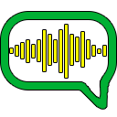
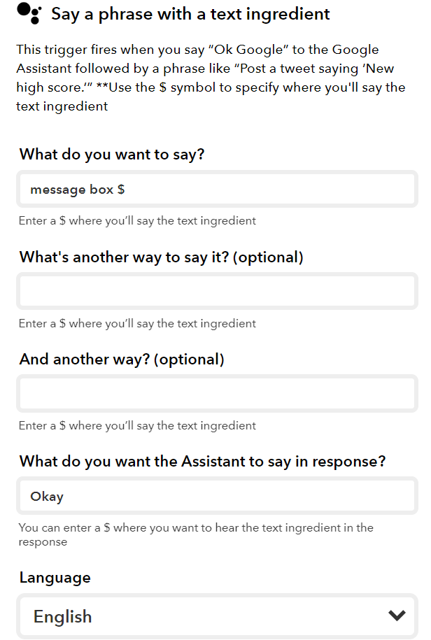
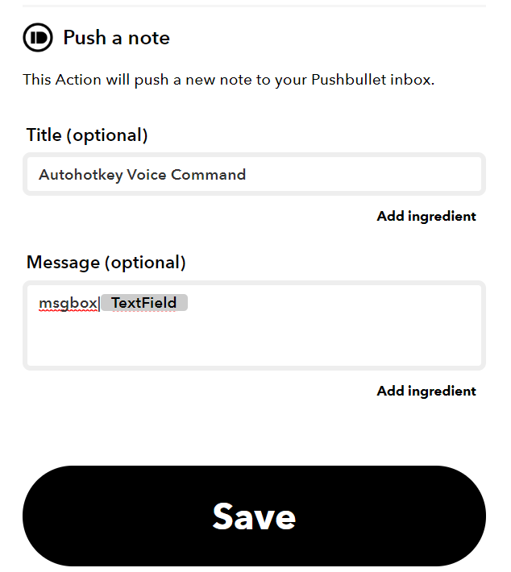

# Autohotkey Voice Command

This is a script to listen for new messages in Push Bullet via API.
When it notice a new message, and the message syntax for the command is valid, it will execute the action on your PC.

Here is the flow of the program:

Google Home / Alexa > IFTTT > Push Bullet > AHKVC

So for this to work you need to set up your IFTTT to push a note to PushBullet and AHKVC will do the rest.

Here are the list of commands already made, you just need to push a note with proper syntax. You can make your own command too !

# List of Commands:
* shutdown
* logout
* hibernate
* sleep
* restart
* monitor_off - turn off your monitor
* lockinput
  - On ( lockinput|on  )
  - Off ( lockinput|off )
* open|`<speech>`
  - So the file path need to be set inside the script and when you say for example you set the phrase to be "Hey google, open google" on IFTTT then it will push the note "open|google" and in .ahk script you will need to code > If it matches the keyword, it will open a file path that is linked with the key phrase !
* append|`<speech>`
  - So this is for taking quick note, whenever you say "append $" it will append into the note.txt
* msgbox|`<speech>`
* speech2text|<speech>
  - Convert speech to text
* send|`<speech>`
  - Send a button, e.g: "Hey google, send space"
